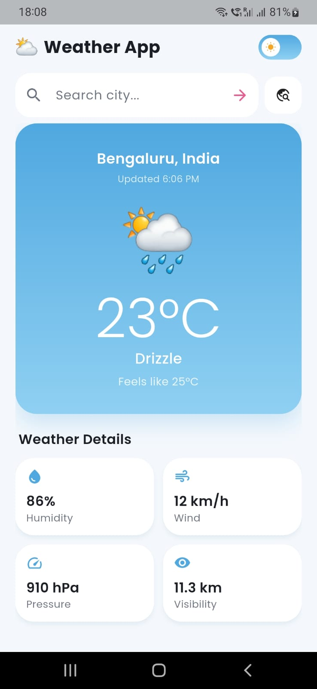
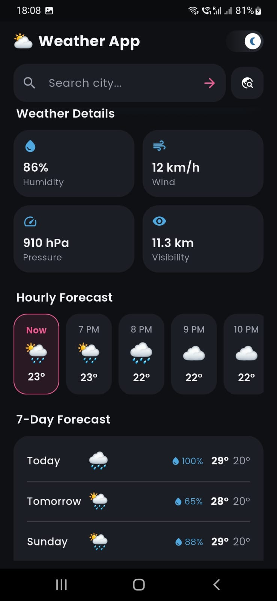

# 🌦️ Live Weather App — Flutter (BLoC + MVVM)

A production-ready, real-time weather dashboard built with **Flutter**, **flutter_bloc**,
and **Clean Architecture (MVVM)**. Weather data comes from **Open-Meteo**
(https://open-meteo.com) — a completely free API that requires **no API key**.

---

## ✨ Features

- Current conditions: temperature, feels-like, condition, humidity, wind, pressure, visibility
- Hourly forecast (next 24h) and 7-day forecast, including sunrise/sunset & precipitation chance
- City search (geocoded via Open-Meteo) + popular-city quick chips
- Pull-to-refresh and an animated "Refresh Weather" button
- Light & dark themes with an animated toggle, built on a Pink / Black / Red / Sky-Blue palette
- Shimmer loading skeletons, staggered entrance animations, animated theme transitions
- Graceful error states: no internet, location not found, server error — each with "Try Again"
- Fully responsive layout (phones & tablets), Google Fonts (Poppins)

---


## 📱 Screenshots

| Live Weather |
|--------------|
|   |


## 🏗️ Architecture

```
lib/
├── core/            # constants, theme, network (Dio/connectivity), utils, DI (get_it)
├── data/            # models (JSON <-> entity), remote datasource, repository impl
├── domain/          # entities, repository contract, use cases, typed Failures
├── presentation/
│   ├── bloc/        # WeatherEvent / WeatherState / WeatherBloc
│   ├── viewmodel/   # ThemeViewModel (Cubit) — MVVM presentation state
│   ├── views/       # HomeScreen, SearchScreen
│   └── widgets/      # Reusable, presentation-only UI components
├── app.dart         # Provider wiring + MaterialApp
└── main.dart        # Entry point
```

Data flow (MVVM):

```
View → BLoC/ViewModel → UseCase → Repository → RemoteDataSource → Open-Meteo API
```

The `WeatherRepository` is an abstract contract in `domain/`; `data/` provides the only
implementation. Widgets never call Dio directly — everything flows through the BLoC.

---

## 🚀 Getting started

This archive contains only the `lib/` Dart source, `pubspec.yaml`, and lint config —
it does not include the native `android/`, `ios/`, `web/`, etc. platform folders,
since those are best generated fresh by the Flutter CLI for your installed Flutter version.

1. **Create a new Flutter project shell and copy this source in:**
   ```bash
   flutter create live_weather_app
   cd live_weather_app
   # copy the contents of this archive's lib/, pubspec.yaml, and analysis_options.yaml
   # into the newly created project, overwriting the defaults
   ```

2. **Install dependencies:**
   ```bash
   flutter pub get
   ```

3. **Add Internet permission (Android):**
   In `android/app/src/main/AndroidManifest.xml`, add inside `<manifest>` (above `<application>`):
   ```xml
   <uses-permission android:name="android.permission.INTERNET" />
   ```
   (Most `flutter create` templates already include this by default.)

4. **iOS:** No extra configuration needed for HTTPS requests to Open-Meteo, since
   App Transport Security allows HTTPS by default.

5. **Run:**
   ```bash
   flutter run
   ```

---

## 🔌 API used

- Forecast: `https://api.open-meteo.com/v1/forecast`
- Geocoding (city search): `https://geocoding-api.open-meteo.com/v1/search`

No sign-up, no API key, no rate-limit headaches for development/demo use.

---

## 🧩 Notes on choices

- **Weather icons** are emoji rather than bundled image/Lottie assets, so the app
  has zero extra binary assets and renders crisp icons on every platform out of the box.
  `lottie` is included as a dependency if you'd like to swap in animated icon sets later.
- **State preservation on refresh/error**: `WeatherLoading` and `WeatherError` both carry
  an optional `previousWeather`, so the UI keeps showing the last good data (with a subtle
  loading/error indicator) instead of flashing to a blank screen — this is what powers
  smooth pull-to-refresh.
- **Dependency injection** uses `get_it` as a simple service locator, registered once in
  `core/di/service_locator.dart` and consumed by `BlocProvider`s in `app.dart`.
